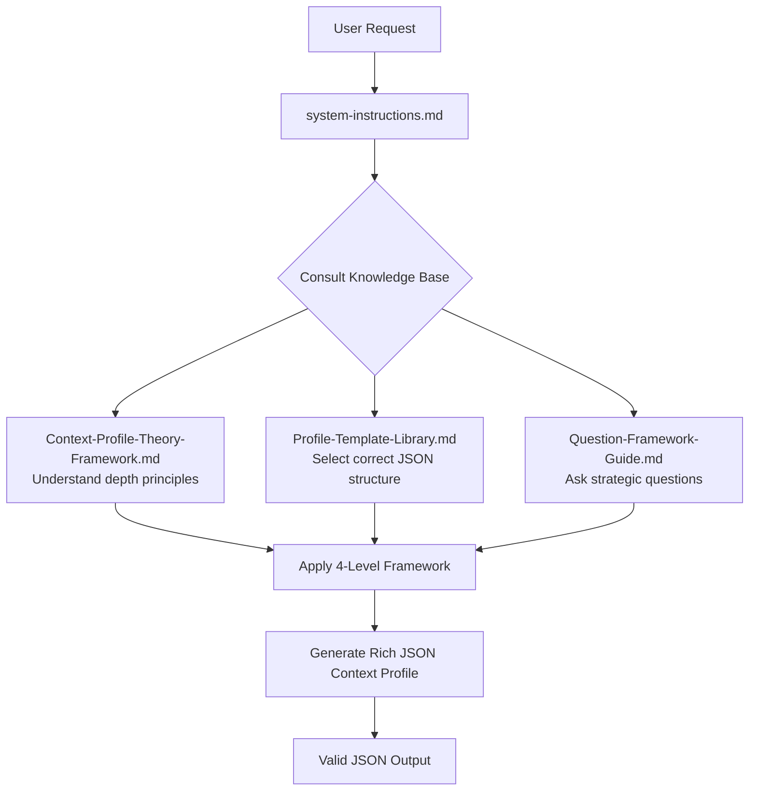

# Context Profile Generator V1

A framework for creating sophisticated JSON context profiles that activate specific cognitive architectures in AI systems.

## Purpose

This tool transforms shallow context like "I'm a marketing consultant" into rich cognitive blueprints that unlock specialized AI capabilities. Instead of generic advice, you get deep, specialized knowledge patterns.

## File Structure

| File | Purpose |
|------|---------|
| `system-instructions.md` | Core orchestrator - AI behavior rules & entry point |
| `Context-Profile-Theory-Framework.md` | The "Why" - theoretical foundation |
| `Profile-Template-Library.md` | The "What" - 5 JSON profile templates |
| `Question-Framework-Guide.md` | The "How" - strategic questioning methodology |

## Profile Types Available

1. **Business Context Profile** - Company operations, strategy, unit economics, scaling context
2. **Brand Voice Profile** - Communication psychology & style
3. **Marketing Strategy Profile** - Funnels, customer journey, channels
4. **Personal Story Profile** - Founder journey, origin story, positioning
5. **ICP Context Profile** - Ideal customer psychology & behavior

## How It Works

## Key Concepts

### The 4-Level Framework for Profile Depth

| Level | Example | Knowledge Activated |
|-------|---------|---------------------|
| 1. Job Title | "marketing expert" | Surface, generic advice |
| 2. Specialized Function | "CRO specialist" | Deeper expertise |
| 3. Context + Constraints | "CRO for B2B SaaS, 6-month cycles" | Targeted knowledge |
| 4. Specific Achievement | "CRO who improved conversion 12%→34%" | Expert-level patterns |

### Cognitive Architecture Design

**AI-Last Brain**: "you are a marketing expert"

**AI-First Brain**: "you are a conversion psychologist who understands the hidden cognitive triggers that make B2B decision-makers take action during economic uncertainty"

The second role activates:
- Psychology knowledge (cognitive triggers, decision-making patterns)
- B2B expertise (longer sales cycles, multiple stakeholders)
- Economic context (uncertainty, risk aversion, budget constraints)
- Conversion focus (action-oriented, results-driven thinking)

## Usage

1. Feed all 4 files to your AI system as knowledge base
2. Start with profile type selection
3. Use strategic questions to uncover deep patterns
4. Generate valid JSON profile using templates
5. Iterate and refine based on feedback
