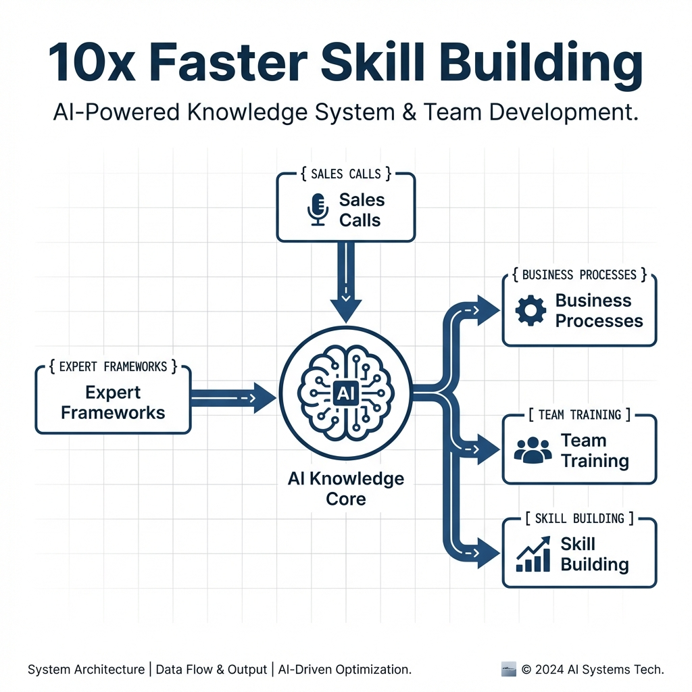
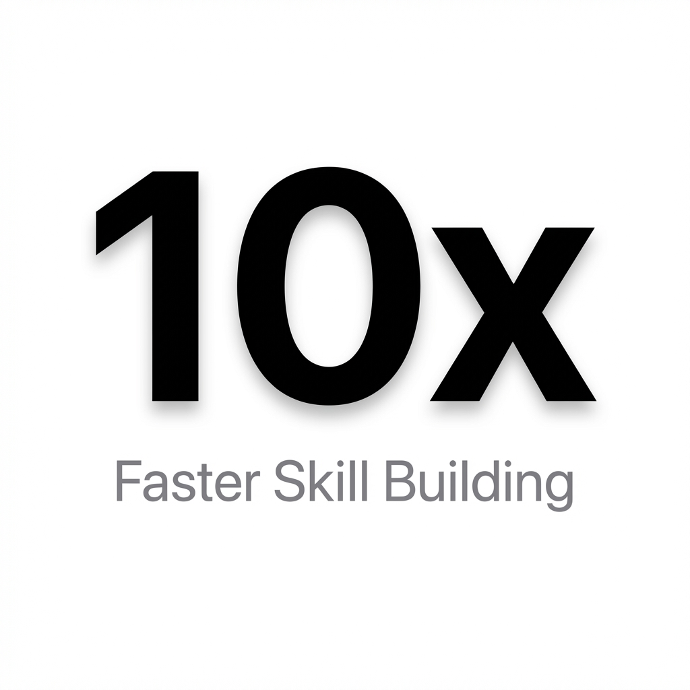
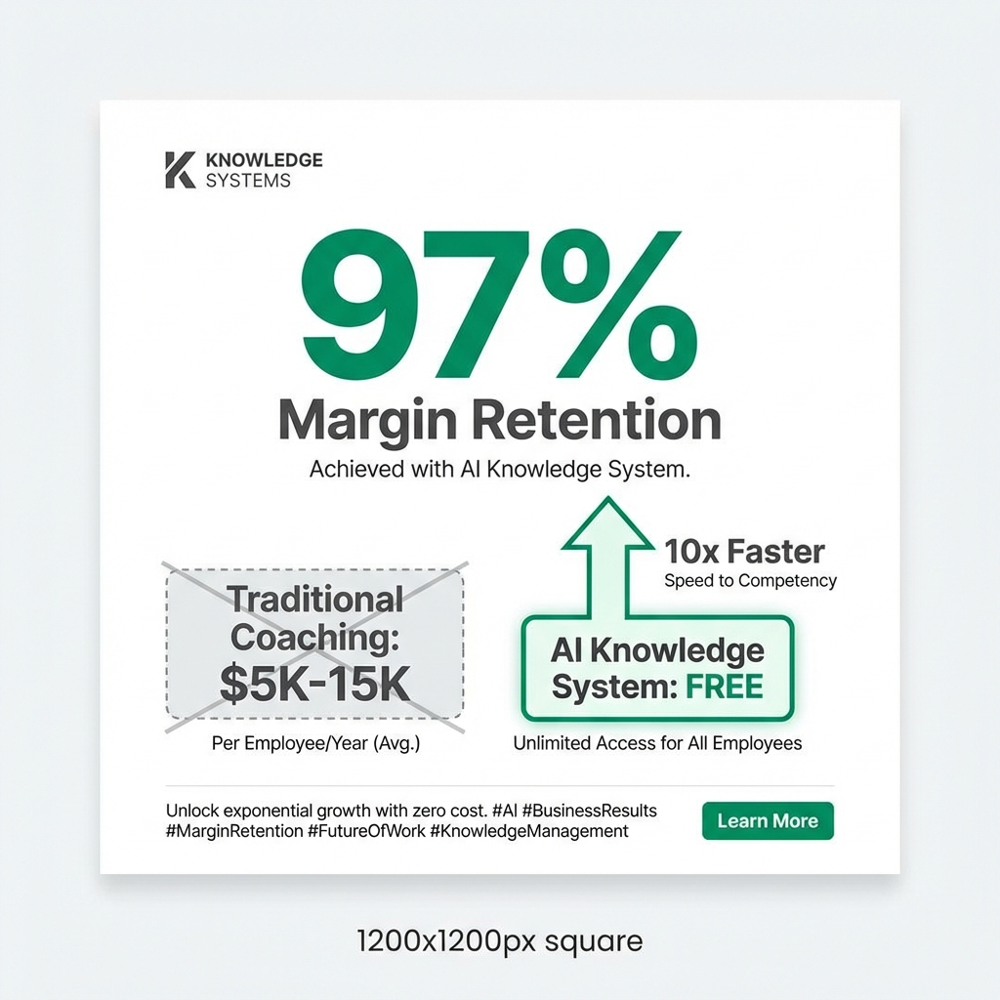

# AI Skill Building System

**Source**: Example from directive
**Created**: 2026-01-12
**Status**: Drafting

---

## Hook
This FREE AI system builds skills 10x faster than courses or coaching.

(I used it to train my entire team & keep 97% margins)

---

## Full Post

This FREE AI system builds skills 10x faster than courses or coaching.

(I used it to train my entire team & keep 97% margins)

I'm showing you how to access ,000 worth of business frameworks using AI.

No courses. No coaches. Just world-class knowledge applied to YOUR specific business.

---

    :

You're the ceiling of your business.

Your team can't perform better than you can teach them.

But hiring coaches costs -.
And courses don't apply to YOUR specific situation.

---

 :

Build a custom AI knowledge base with frameworks from the best in the world.

Then use it to train yourself AND your team.

---

  :

 Upload frameworks from experts (Hormozi, Chris Voss, etc.)
 Add your sales calls, processes, and best practices
 Ask the AI specific questions about YOUR business
 Get answers that combine expert frameworks with your context

---

 :

My team practices objection handling with an AI that knows our exact process.

They get instant feedback.
They improve 10x faster.
And I don't have to be in every training session.

---

Comment 'FRAMEWORK' below and I'll send you the exact setup.

95% will scroll past this.
5% will build a system that scales their expertise.

 Repost to help someone build leverage.

[Video]

---

## Metadata
- **Content Type**: Text
- **CTA Type**: Comment Below
- **Target Audience**: General ICP
- **Key Topics**: AI, Training, Frameworks, Team Building

---

## Image Prompts & Assets

```json
{
  "post_context": {
    "post_reference": "1.ai-skill-building-system.md",
    "created_date": "2026-01-12",
    "hook_text": "This FREE AI system builds skills 10x faster than courses or coaching.",
    "key_insight": "Custom AI knowledge base with expert frameworks for team training",
    "result_metrics": "10x faster, 97% margins retained",
    "key_topics": ["AI", "Training", "Frameworks", "Team Building"]
  },
  "meta": {
    "platform": "LinkedIn",
    "aspect_ratio": "1:1",
    "dimensions": "1200x1200px"
  },
  "base_style": {
    "background": "pure white (#FFFFFF)",
    "background_cleanliness": "Maximum (no distractions, no patterns)",
    "aesthetic": "minimalistic, clean, professional"
  },
  "variations": [
    {
      "style_name": "technical",
      "style_id": 1,
      "prompt": "Minimalistic technical diagram on pure white background, showing an AI knowledge-building system as a clean flowchart. Central AI brain icon connected to three input nodes: Expert Frameworks, Sales Calls, Business Processes. Output arrows flowing to Team Training and Skill Building nodes. Modern sans-serif typography, deep blue (#1E3A5F) accent lines, subtle grid pattern. Professional LinkedIn post image, 1200x1200px, high contrast, no gradients, clean vector style, generous whitespace. '10x Faster Skill Building' as bold headline at top."
    },
    {
      "style_name": "apple",
      "style_id": 2,
      "prompt": "Apple-style minimalist design on pure white background. Single hero element: the number '10x' in massive, elegant bold typography as the central focal point. Ultra-clean typography with subtle shadow for depth. 'Faster Skill Building' as refined subheadline below in space gray (#86868B). San Francisco Pro style font. Premium aesthetic inspired by Apple keynote slides. 1200x1200px, elegant simplicity, centered composition, professional corporate aesthetic, no gradients, maximum whitespace."
    },
    {
      "style_name": "business_results",
      "style_id": 3,
      "result_type": "Savings",
      "prompt": "Business results infographic on pure white background. Hero metric comparison: large '97%' in bold green (#059669) as the main focal point representing margin retention. Clean before/after visualization: 'Traditional Coaching: $5K-15K' crossed out in gray vs 'AI Knowledge System: FREE' highlighted. Arrow pointing upward with '10x Faster' label. Modern sans-serif typography, minimalist design. Professional LinkedIn post, 1200x1200px, high-impact numbers, clear visual hierarchy, corporate clean aesthetic."
    }
  ]
}
```

### Visual Executions

**1. Technical Style**


**2. Apple Style**


**3. Business Results Style**
