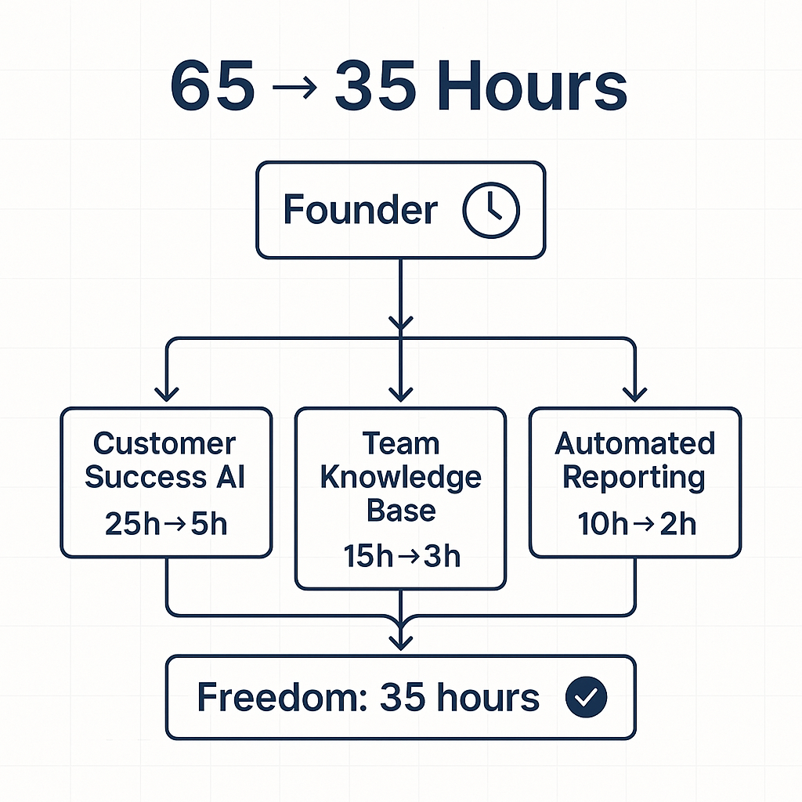
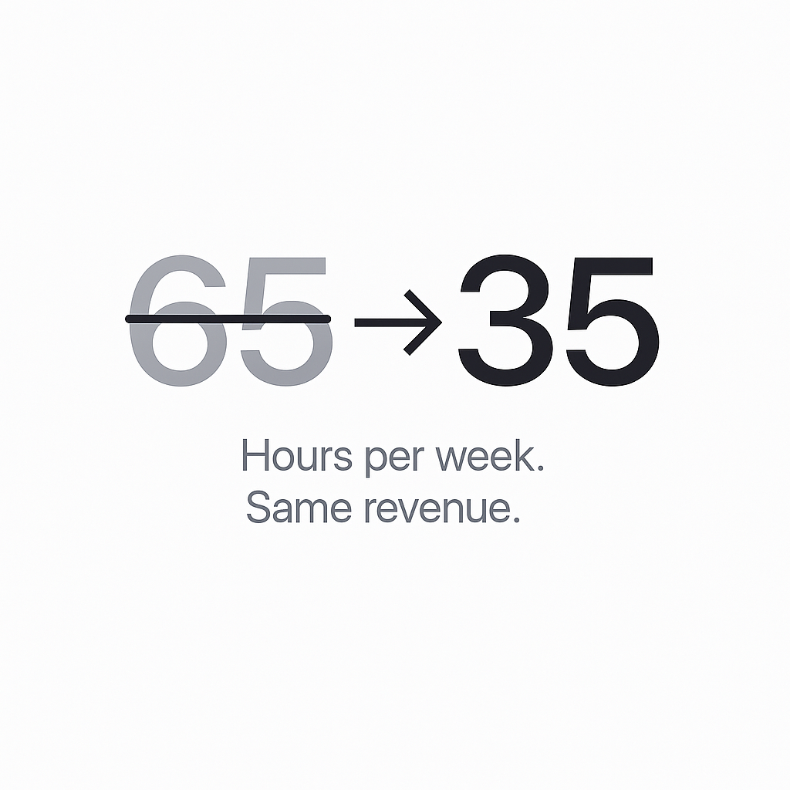
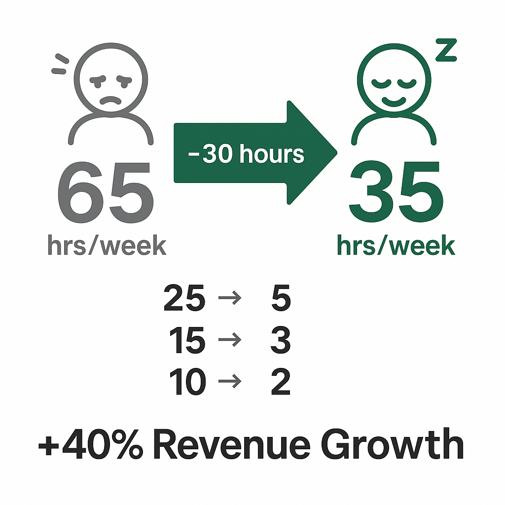

## Generated Hooks

### Recommended Hook
```json
{
  "hook_text": "This AI system cut a founder's workweek from 65 hours to 35. Same revenue. Same team.",
  "hook_format": "Statement + Proof",
  "strength_score": 0.92,
  "best_for_platforms": ["LinkedIn"],
  "emotion_target": "Desire + Curiosity"
}
```

### Alternative Hooks
```json
[
  {
    "hook_text": "A $5M founder was working 65 hours a week. 3 months later, he works 35. Here's what changed.",
    "hook_format": "Narrative + Transformation",
    "strength_score": 0.88,
    "best_for_platforms": ["LinkedIn"],
    "emotion_target": "Aspiration + Curiosity"
  },
  {
    "hook_text": "Your business can only grow as fast as you can let go. Here's the system that makes letting go possible.",
    "hook_format": "Statement + Conditional",
    "strength_score": 0.84,
    "best_for_platforms": ["LinkedIn"],
    "emotion_target": "Recognition + Hope"
  }
]
```

---

## Full Post

This AI system cut a founder's workweek from 65 hours to 35. Same revenue. Same team.

(And he finally took a vacation without checking Slack every hour)

Stop me if this sounds familiar:

You're the answer to every question.
You're the bottleneck for every decision.
Your team can't move without you.

Your business runs on you, not on systems.

---

𝗧𝗵𝗲 𝗽𝗿𝗼𝗯𝗹𝗲𝗺:

You're doing $3M-$10M but working like you're still at $500K.

More revenue didn't mean less work. It meant more fires.

You hired people to help. But now you spend half your time managing them.

The business grew. Your freedom didn't.

---

𝗛𝗲𝗿𝗲'𝘀 𝘄𝗵𝗮𝘁 𝘄𝗲 𝗯𝘂𝗶𝗹𝘁:

A founder came to us drowning in operations.

→ 25 hours/week on customer success
→ 15 hours/week answering team questions
→ 10 hours/week on reporting
→ No time for product or growth

Three areas. Three AI systems. 90 days.

---

𝗦𝘆𝘀𝘁𝗲𝗺 𝟭: 𝗖𝘂𝘀𝘁𝗼𝗺𝗲𝗿 𝗦𝘂𝗰𝗰𝗲𝘀𝘀 𝗔𝗜

→ AI handles 80% of customer inquiries automatically
→ Routes complex issues with full context
→ Drafts personalized responses for human approval
→ 25 hours → 5 hours weekly

𝗦𝘆𝘀𝘁𝗲𝗺 𝟮: 𝗧𝗲𝗮𝗺 𝗞𝗻𝗼𝘄𝗹𝗲𝗱𝗴𝗲 𝗕𝗮𝘀𝗲

→ AI trained on every process, decision, playbook
→ Team asks AI before asking founder
→ Answers with founder's logic and context
→ 15 hours → 3 hours weekly

𝗦𝘆𝘀𝘁𝗲𝗺 𝟯: 𝗔𝘂𝘁𝗼𝗺𝗮𝘁𝗲𝗱 𝗥𝗲𝗽𝗼𝗿𝘁𝗶𝗻𝗴

→ Dashboards update automatically
→ AI summarizes what matters
→ Anomalies flagged, not just displayed
→ 10 hours → 2 hours weekly

---

𝗧𝗵𝗲 𝗿𝗲𝘀𝘂𝗹𝘁:

50 hours of founder work → 10 hours.

Same team. Same revenue. Actually, revenue grew 40% the next year.

Why? Because the founder finally had time to work ON the business.

---

The real question isn't "Can AI save me time?"

It's "What would you do with 30 extra hours a week?"

Your bottleneck is always you.

Until you decide it doesn't have to be.

♻️ Repost if you know a founder who needs their life back.

---

## Metadata
- **Content Type**: Text
- **CTA Type**: Repost
- **Target Audience**: Founders, CEOs, Business Owners
- **Key Topics**: AI Systems, Founder Bottleneck, Time Savings, Automation, Business Operations

---

## Image Prompts & Assets

```json
{
  "post_context": {
    "post_reference": "3.founder-bottleneck-ai-system.md",
    "created_date": "2026-01-16",
    "hook_text": "This AI system cut a founder's workweek from 65 hours to 35. Same revenue. Same team.",
    "key_insight": "Three AI systems to eliminate founder bottleneck: Customer Success AI, Team Knowledge Base, Automated Reporting",
    "result_metrics": "65 hours → 35 hours, 50 hours of work → 10 hours, 40% revenue growth",
    "key_topics": ["AI Systems", "Founder Bottleneck", "Time Savings", "Automation"]
  },
  "meta": {
    "platform": "LinkedIn",
    "aspect_ratio": "1:1",
    "dimensions": "1200x1200px"
  },
  "base_style": {
    "background": "pure white (#FFFFFF)",
    "background_cleanliness": "Maximum (no distractions, no patterns)",
    "aesthetic": "minimalistic, clean, professional"
  },
  "variations": [
    {
      "style_name": "technical",
      "style_id": 1,
      "prompt": "Minimalistic technical diagram on pure white background, showing a founder bottleneck elimination system as a clean flowchart. Central 'Founder' node at top with clock icon showing 65h, connected by arrows to three AI system boxes below: 'Customer Success AI' (25h→5h), 'Team Knowledge Base' (15h→3h), 'Automated Reporting' (10h→2h). All three boxes connect to bottom node showing 'Freedom: 35 hours' with checkmark. Modern sans-serif typography, deep blue (#1E3A5F) accent lines, subtle grid pattern. Professional LinkedIn post image, 1200x1200px, high contrast, no gradients, clean vector style, generous whitespace. '65 → 35 Hours' as bold headline at top."
    },
    {
      "style_name": "apple",
      "style_id": 2,
      "prompt": "Apple-style minimalist design on pure white background. Single hero element: large '65→35' transformation numbers as the central focal point, with '65' in light gray crossed out and '35' in bold near-black (#1D1D1F). Ultra-clean typography with subtle shadow for depth. 'Hours per week. Same revenue.' as refined subheadline below in space gray (#86868B). San Francisco Pro style font. Premium aesthetic inspired by Apple keynote slides. 1200x1200px, elegant simplicity, centered composition, professional corporate aesthetic, no gradients, maximum whitespace."
    },
    {
      "style_name": "business_results",
      "style_id": 3,
      "result_type": "Time",
      "prompt": "Business results infographic on pure white background. Hero metric comparison showing dramatic time savings. Left side: '65 hrs/week' in muted gray with small stressed founder icon. Right side: '35 hrs/week' in bold green (#059669) with relaxed founder icon. Large green arrow connecting them with '-30 hours' label. Below: three mini metrics showing '25→5', '15→3', '10→2' for each AI system. Bottom text: '+40% Revenue Growth' in bold black. Modern sans-serif typography, minimalist design. Professional LinkedIn post, 1200x1200px, high-impact numbers, clear visual hierarchy, corporate clean aesthetic."
    }
  ]
}
```

### Visual Executions

**1. Technical Style**


**2. Apple Style**


**3. Business Results Style**

