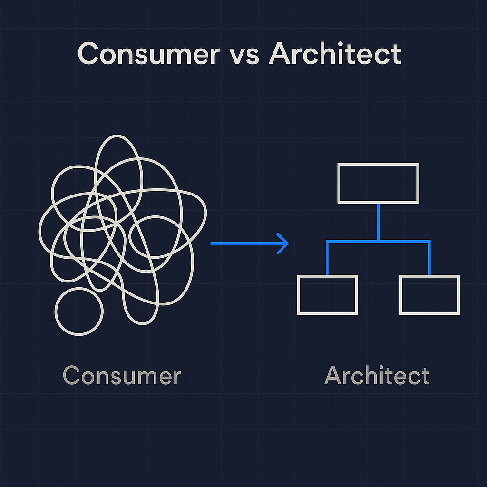
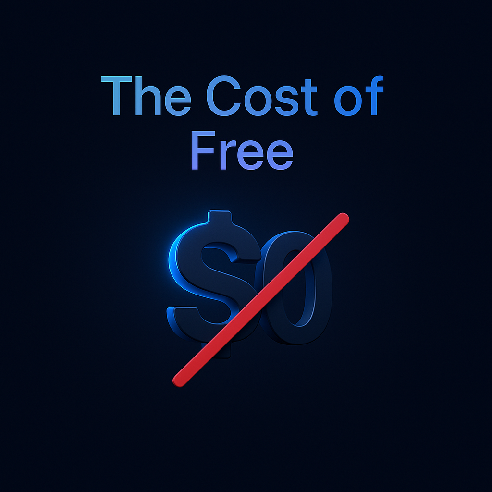
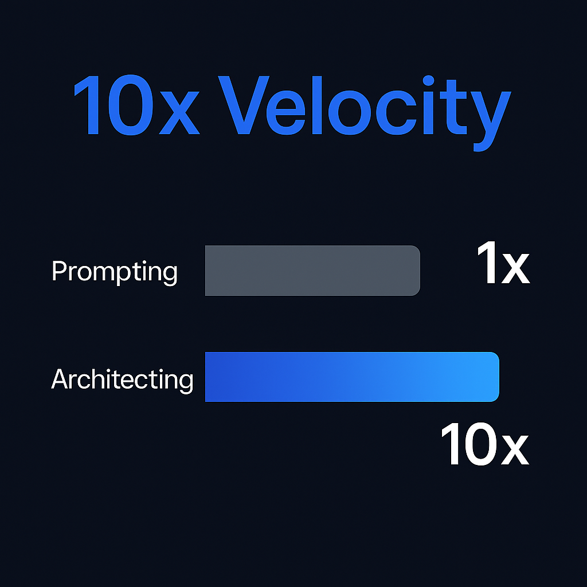

## Generated Hooks

### Recommended Hook
```json
{
  "hook_text": "The $0/month AI plan is now the most expensive mistake in your business. (And OpenAI just proved why)",
  "hook_format": "Statement + Provocative",
  "strength_score": 0.94,
  "best_for_platforms": ["LinkedIn"],
  "emotion_target": "Urgency + Superiority"
}
```

### Alternative Hooks
```json
[
  {
    "hook_text": "Agency Owners: If you're still building on the 'Free' tier, you're building on rented land that's being subdivided for billboards.",
    "hook_format": "Label + Conditional",
    "strength_score": 0.92,
    "best_for_platforms": ["LinkedIn"],
    "emotion_target": "Fear of Loss + Realization"
  },
  {
    "hook_text": "ChatGPT just admitted they can't afford you. (Here is the blueprint for the ad-free infrastructure we build instead)",
    "hook_format": "Statement + Proof",
    "strength_score": 0.91,
    "best_for_platforms": ["LinkedIn"],
    "emotion_target": "Curiosity + Authority"
  },
  {
    "hook_text": "AI is no longer a 'cool tool.' It's your new abstraction layer. And it's officially too expensive to be free.",
    "hook_format": "Statement + Logical Conclusion",
    "strength_score": 0.89,
    "best_for_platforms": ["LinkedIn"],
    "emotion_target": "Strategic Insight"
  },
  {
    "hook_text": "Stop prompting ChatGPT and start architecting your own intelligence. (OpenAI just put a price tag on your focus)",
    "hook_format": "Command + Kicker",
    "strength_score": 0.88,
    "best_for_platforms": ["LinkedIn"],
    "emotion_target": "Direct Action"
  },
  {
    "hook_text": "I used to think free AI was a gift. Then I saw the unit economics. OpenAI’s move to ads just proved me right.",
    "hook_format": "Narrative + Insight",
    "strength_score": 0.87,
    "best_for_platforms": ["LinkedIn"],
    "emotion_target": "Relatability + Wisdom"
  },
  {
    "hook_text": "Would you let a billboard interrupt your lead developer in the middle of a sprint? Because that's exactly what just happened to your 'Free' ChatGPT team.",
    "hook_format": "Yes Question + Provocative",
    "strength_score": 0.86,
    "best_for_platforms": ["LinkedIn"],
    "emotion_target": "Logical Pain"
  },
  {
    "hook_text": "If you don't own your AI infrastructure, you don't own your business velocity. OpenAI's new ad tier just confirmed it.",
    "hook_format": "Conditional + Statement",
    "strength_score": 0.85,
    "best_for_platforms": ["LinkedIn"],
    "emotion_target": "Control + FOMO"
  },
  {
    "hook_text": "ChatGPT Ads aren't a bug. They're a feature for serious operators—a signal to finally move to professional architecture.",
    "hook_format": "Contrarian Statement",
    "strength_score": 0.84,
    "best_for_platforms": ["LinkedIn"],
    "emotion_target": "Superiority"
  },
  {
    "hook_text": "5 reasons OpenAI’s move to ads is the best thing to happen to your agency workflow. (Hint: It's about ownership)",
    "hook_format": "List + Kicker",
    "strength_score": 0.83,
    "best_for_platforms": ["LinkedIn"],
    "emotion_target": "Curiosity"
  },
  {
    "hook_text": "Your AI is about to start selling you stuff. Maybe it's time you started building the AI that sells for you.",
    "hook_format": "Open Question/Choice",
    "strength_score": 0.82,
    "best_for_platforms": ["LinkedIn"],
    "emotion_target": "Irony + Action"
  }
]
```

# ChatGPT Ads Analysis LinkedIn Post


**ChatGPT just introduced ads for free users.**

The "Free Lunch" era of AI is officially over. 

(And if you're a business owner, this is actually a signal you should celebrate)

OpenAI’s decision to monetize the Free and "Go" tiers isn't just a revenue play. It’s a reality check on the **Unit Economics of Intelligence.**

Compute isn’t free. Tokens aren’t free. 

And "Raw AI" is rapidly becoming a commodity.

---

𝗧𝗵𝗲 𝘀𝗵𝗶𝗳𝘁 𝗳𝗿𝗼𝗺 𝗨𝘀𝗲𝗿 𝘁𝗼 𝗔𝗿𝗰𝗵𝗶𝘁𝗲𝗰𝘁:

Most people use ChatGPT like a search engine. 
They input a prompt → they getting an output.

But as platforms move toward ad-supported models, the gap between "Consumers" and "Architects" will widen.

Consumers will deal with:
→ Contextual ads breaking their flow
→ Limited memory on lower tiers
→ Generic, non-specialized responses

Architects will build:
→ Custom Agentic Workflows
→ Private Vector Databases
→ Efficient Infrastructure that they *own*

---

𝗪𝗵𝘆 𝘁𝗵𝗶𝘀 𝗺𝗮𝘁𝘁𝗲𝗿𝘀 𝗳𝗼𝗿 𝘆𝗼𝘂𝗿 𝗯𝘂𝘀𝗶𝗻𝗲𝘀𝘀:

AI is no longer a "cool tool." It is the new **Abstraction Layer** for your entire operations.

If your business relies on "Free Tier" logic, you are building on rented land that is currently being subdivided for billboards.

At **Braind AI**, we don't look at AI as a chatbot. We look at it as **Infrastructure.**

The "Vision vs Blueprint" methodology exists because:
1️⃣ The **Vision** defines the business outcome.
2️⃣ The **Blueprint** defines the technical logic (the Input -> Output flow).

When you have a blueprint, you don't care about the "Ads" on a free platform. 

You care about the **Velocity** of your custom system.

---

𝗧𝗵𝗲 𝗟𝗼𝗴𝗶𝗰𝗮𝗹 𝗖𝗼𝗻𝗰𝗹𝘂𝘀𝗶𝗼𝗻:

The market is maturing. 

Just like the early days of the internet, the "free" phase was used to onboard the masses. The "pro" phase is where the real value is extracted.

Stop trying to "prompt" your way to a solution on a free interface.

Start architecting systems that create a moat around your business.

**Efficiency is the only sustainable competitive advantage.**

---

How are you preparing for the shift toward "Paid-only" or "Ad-supported" AI infrastructure?

DM if you want to see the blueprint of how we build ad-free, high-velocity agentic systems for agencies.

🛠 **Braind AI | Vision -> Blueprint -> Velocity**

#ArtificialIntelligence #AIAgency #Automation #ChatGPT #BusinessStrategy #SystemArchitecture

---

## Image Prompts & Assets

```json
{
  "post_reference": "chatgpt_ads_analysis.md",
  "created_date": "2026-01-19",
  "post_context": {
    "hook_text": "The $0/month AI plan is now the most expensive mistake in your business. (And OpenAI just proved why)",
    "key_insight": "The gap between Consumers and Architects is widening. Move from a free plan to owned infrastructure.",
    "result_metrics": "$0/month -> High Opportunity Cost",
    "key_topics": ["AI Strategy", "Infrastructure", "Ownership"]
  },
  "meta": {
    "platform": "LinkedIn",
    "aspect_ratio": "1:1",
    "dimensions": "1200x1200px"
  },
  "variations": [
    {
      "style_name": "technical",
      "prompt": "Minimalistic technical diagram on a background of Deep Navy (#0A1628). The diagram shows a clean flowchart transitioning from a messy 'Consumer' input to a structured 'Architect' blueprint. Use Electric Blue (#3B82F6) for accent lines and a subtle grid pattern in Warm Gray (#64748B). Modern sans-serif typography (Space Grotesk style). High contrast, premium vector aesthetic, generous whitespace. 'Consumer vs Architect' as bold headline."
    },
    {
      "style_name": "apple",
      "prompt": "Apple-style minimalist design on a background of Deep Navy (#0A1628). Single hero element: A sleek, 3D-rendered minimalist $0 icon with a subtle Electric Blue (#3B82F6) glow and a red 'X' through it. Ultra-clean typography in Inter or San Francisco Pro style. Premium aesthetic with soft cyan-to-purple gradients in the highlights. 'The Cost of Free' as main text. Keynote presentation quality, 1200x1200px, elegant simplicity."
    },
    {
      "style_name": "business_results",
      "prompt": "Business results infographic on a background of Deep Navy (#0A1628). Hero metric: '10x Velocity' in bold Electric Blue (#3B82F6). Data visualization comparing 'Prompting' (slow, gray) vs 'Architecting' (fast, electric blue gradient). Space Grotesk typography for high-impact numbers. Professional LinkedIn post, 1200x1200px, clear visual hierarchy, premium tech feel."
    }
  ]
}
```

### Visual Executions

**1. Technical Style**


**2. Apple Style**


**3. Business Results Style**

