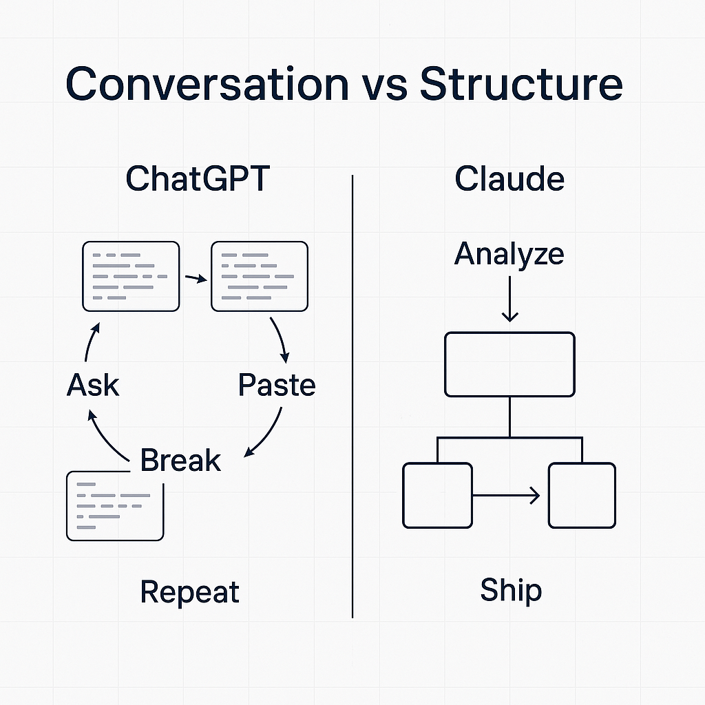
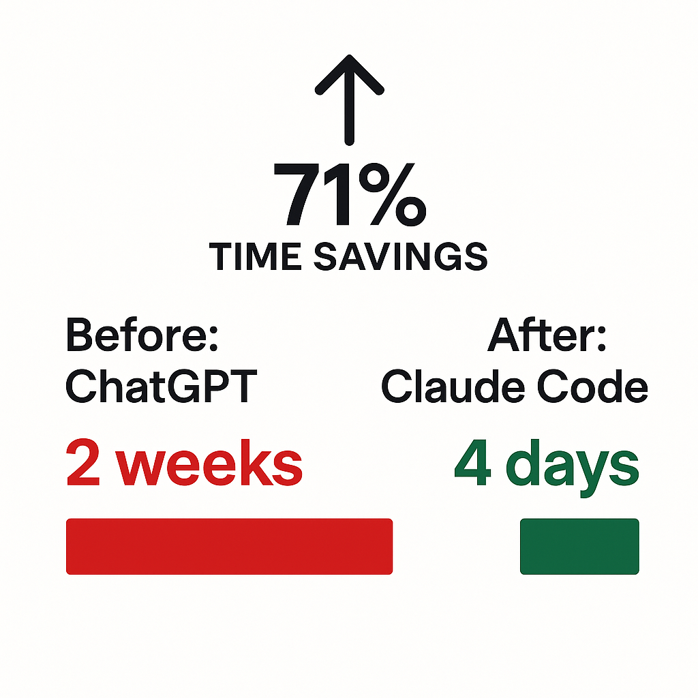

# The Claude Switch

**I stopped using ChatGPT for production code.**

Not because it's bad.
Because it's optimized for the wrong thing.

---

Most people default to ChatGPT because it's the "famous" AI.

But here's what I learned after shipping a production app in under a week using a codebase I'd never touched before:

**ChatGPT is built for conversation.**
**Claude is built for structure.**

And when you're building real systems (not just prototypes), structure wins.

---

### The Difference

**ChatGPT:**
- Great for brainstorming
- Great for explaining concepts
- Great for quick scripts

**Claude (especially Claude Code):**
- Better at maintaining context across long codebases
- Better at following specific architectural patterns
- Better at generating production-ready code (not just "code that works")

---

### The Real Test

Last week, I had to build a feature in a codebase I'd never seen before.

**With ChatGPT:**
- I'd ask: "How do I add X?"
- It would give me a snippet.
- I'd paste it in.
- It would break something else.
- Repeat 10 times.

**With Claude Code:**
- I'd describe the feature.
- It would analyze the existing architecture.
- It would suggest where the code should live.
- It would generate code that *fits* the existing patterns.

**Result:** Shipped in 4 days instead of 2 weeks.

---

### When to Use What

**Use ChatGPT for:**
- Learning new concepts
- Quick one-off scripts
- Explaining technical ideas to non-technical people

**Use Claude for:**
- Production codebases
- Complex multi-file refactors
- Maintaining architectural consistency

**Use Claude Code for:**
- Building features in unfamiliar codebases
- Large-scale refactoring
- When you need the AI to "understand" the whole project

---

**The Lesson:**

There's no "one AI to rule them all."

The best developers don't just use AI.
They know *which* AI to use for *which* task.

**What's your AI stack? Drop it below.**

#AI #Claude #ChatGPT #ProductionCode #Engineering #DeveloperTools

---

## Image Prompts & Assets

```json
{
  "post_context": {
    "post_reference": "claude_switch.md",
    "created_date": "2026-01-17",
    "hook_text": "I stopped using ChatGPT for production code.",
    "key_insight": "ChatGPT is built for conversation. Claude is built for structure.",
    "result_metrics": "Shipped in 4 days instead of 2 weeks",
    "key_topics": ["AI", "Claude", "ChatGPT", "Production Code", "Structure vs Conversation"]
  },
  "meta": {
    "platform": "LinkedIn",
    "aspect_ratio": "1:1",
    "dimensions": "1200x1200px",
    "model_version": "Nano Banana Pro"
  },
  "base_style": {
    "background": "pure white (#FFFFFF)",
    "background_cleanliness": "Maximum (no distractions, no patterns)",
    "aesthetic": "minimalistic, clean, professional",
    "spacing": "generous whitespace, balanced composition"
  },
  "variations": [
    {
      "style_name": "technical",
      "style_id": 1,
      "subject": {
        "main_element": "Side-by-side comparison flowchart showing ChatGPT workflow (linear, fragmented) vs Claude workflow (architectural, connected)",
        "action_pose": "Static, informational",
        "styling": "Technical/Engineering"
      },
      "visual_style": {
        "art_direction": "Flat Illustration",
        "material_finish": "Clean vector, matte",
        "color_palette": ["#FFFFFF (background)", "#1E3A5F (deep blue accent)", "#1F2937 (dark text)", "#E5E7EB (subtle lines)"]
      },
      "environment": {
        "setting": "Pure white void",
        "lighting": "Flat, even, no shadows",
        "background_cleanliness": "Maximum"
      },
      "text_integration": {
        "enabled": true,
        "content": "Conversation vs Structure",
        "typography_style": "Bold sans-serif, dark gray"
      },
      "technical_specs": {
        "depth_of_field": "None (flat)",
        "camera_angle": "Straight-on",
        "render_quality": "High contrast, vector clean"
      },
      "prompt": "Minimalistic technical diagram on pure white background, showing two parallel workflows side by side. Left side labeled 'ChatGPT': fragmented code snippets with broken arrows, showing 'Ask → Paste → Break → Repeat' cycle. Right side labeled 'Claude': connected architectural diagram with clean flow arrows showing 'Analyze → Integrate → Ship'. Modern sans-serif typography, deep blue (#1E3A5F) accent lines, subtle grid pattern. Bold headline 'Conversation vs Structure' at top. Professional LinkedIn post image, 1200x1200px, high contrast, no gradients, clean vector style, generous whitespace."
    },
    {
      "style_name": "apple",
      "style_id": 2,
      "subject": {
        "main_element": "Large '4 days' hero text with subtle '2 weeks' crossed out below",
        "action_pose": "Centered, prominent",
        "styling": "Premium/Minimal"
      },
      "visual_style": {
        "art_direction": "Apple Keynote Style",
        "material_finish": "Subtle shadow, premium feel",
        "color_palette": ["#FFFFFF (background)", "#1D1D1F (near-black text)", "#86868B (space gray subtext)", "#F5F5F7 (soft shadow)"]
      },
      "environment": {
        "setting": "Pure white void",
        "lighting": "Soft, diffused, subtle depth",
        "background_cleanliness": "Maximum"
      },
      "text_integration": {
        "enabled": true,
        "content": "4 days. Not 2 weeks.",
        "typography_style": "SF Pro style, bold hero text with gray subtext"
      },
      "technical_specs": {
        "depth_of_field": "Subtle (very shallow)",
        "camera_angle": "Eye-level, centered",
        "render_quality": "Keynote presentation quality"
      },
      "prompt": "Apple-style minimalist design on pure white background. Single hero element: large bold '4 days' in near-black (#1D1D1F) centered text with subtle shadow. Below it, smaller space gray (#86868B) text 'Not 2 weeks.' with elegant strikethrough on '2 weeks'. Ultra-clean typography, subtle drop shadow, premium aesthetic. San Francisco Pro style font. Keynote presentation quality, 1200x1200px, elegant simplicity, centered composition, professional corporate aesthetic. No icons, no graphics, just powerful typography."
    },
    {
      "style_name": "business_results",
      "style_id": 3,
      "subject": {
        "main_element": "Before/After timeline comparison showing time savings",
        "action_pose": "Data visualization focus",
        "styling": "Business/Corporate"
      },
      "visual_style": {
        "art_direction": "Infographic Style",
        "material_finish": "Clean, flat, high contrast",
        "color_palette": ["#FFFFFF (background)", "#059669 (success green)", "#DC2626 (negative red)", "#000000 (bold text)", "#6B7280 (secondary gray)"]
      },
      "environment": {
        "setting": "Pure white void",
        "lighting": "Flat, even lighting",
        "background_cleanliness": "Maximum"
      },
      "text_integration": {
        "enabled": true,
        "content": "2 weeks → 4 days",
        "typography_style": "Bold sans-serif numbers, clean labels"
      },
      "technical_specs": {
        "depth_of_field": "None (flat infographic)",
        "camera_angle": "Straight-on",
        "render_quality": "Crisp, high-impact"
      },
      "result_type": "Time",
      "prompt": "Business results infographic on pure white background. Hero comparison: left side shows '2 weeks' in red (#DC2626) with a long progress bar, right side shows '4 days' in green (#059669) with a short progress bar. Large upward arrow indicating 71% time savings. Clean data visualization showing time reduction. Modern sans-serif typography, bold black labels 'Before: ChatGPT' and 'After: Claude Code'. Professional LinkedIn post, 1200x1200px, high-impact numbers, clear visual hierarchy, corporate clean aesthetic. No gradients, flat design."
    }
  ]
}
```

### Visual Executions

**1. Technical Style**


**2. Apple Style**


**3. Business Results Style**

